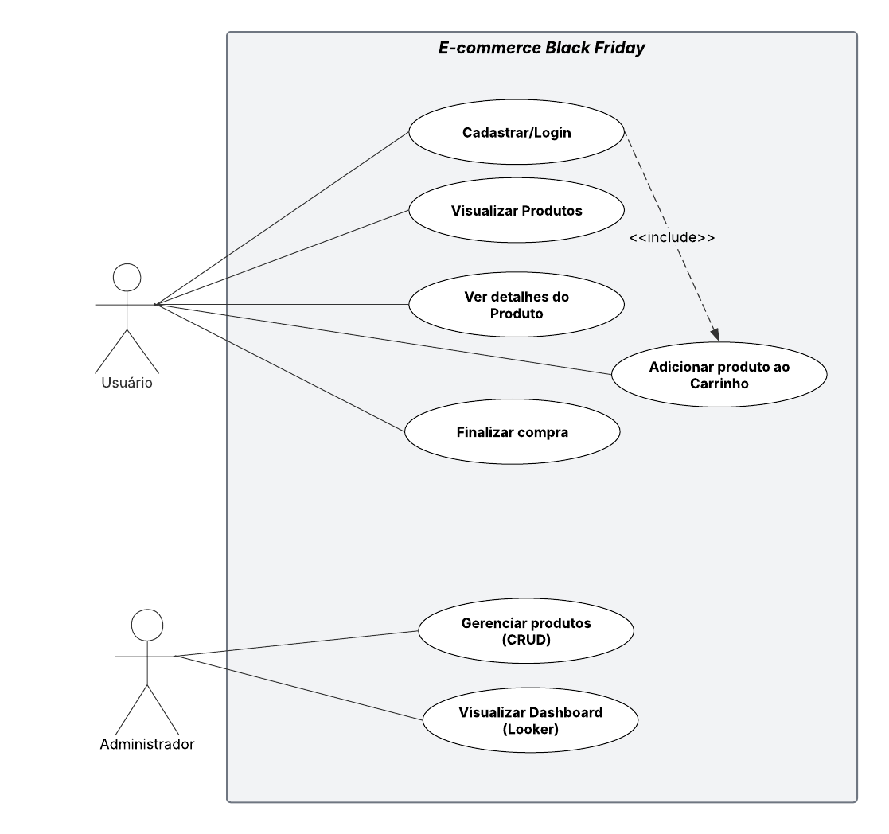

# 🛍️ Site de E-commerce — **Edição Black Friday**

Este projeto foi desenvolvido como parte da disciplina **Desenvolvimento Web**, com o objetivo de aplicar e integrar os principais conceitos estudados ao longo do curso.

## 🎯 Objetivo

O propósito do projeto é consolidar o conhecimento adquirido em **HTML**, **CSS**, **JavaScript**, **PHP** e **MySQL**, promovendo uma experiência completa de integração entre o front-end, o back-end, o banco de dados e a camada de análise de dados.
Além disso, o projeto inclui:

* Integração com o **Google Looker Studio** para criação de dashboards analíticos;
* Consumo de **duas APIs externas** para enriquecer a aplicação com dados dinâmicos.

## 🖥️ Sobre o Site

O site, denominado **ByteShop**, é uma loja virtual especializada em produtos de tecnologia.
As categorias principais são:

* 💻 **Computadores**
* 📱 **Celulares**
* 🎮 **Video Games**

Durante o período da **Black Friday**, o site apresenta promoções exclusivas, destacando produtos e ofertas em destaque na página inicial.

## ⚙️ Tecnologias Utilizadas

| Camada         | Tecnologias             |
| :------------- | :---------------------- |
| Front-end      | HTML5, CSS3, JavaScript |
| Back-end       | PHP                     |
| Banco de Dados | MySQL                   |
| Dashboard      | Google Looker Studio    |
| Integrações    | 2 APIs externas         |

## 📊 Diagrama de Casos de Uso

Abaixo está o diagrama de casos de uso que representa as principais interações do sistema:

