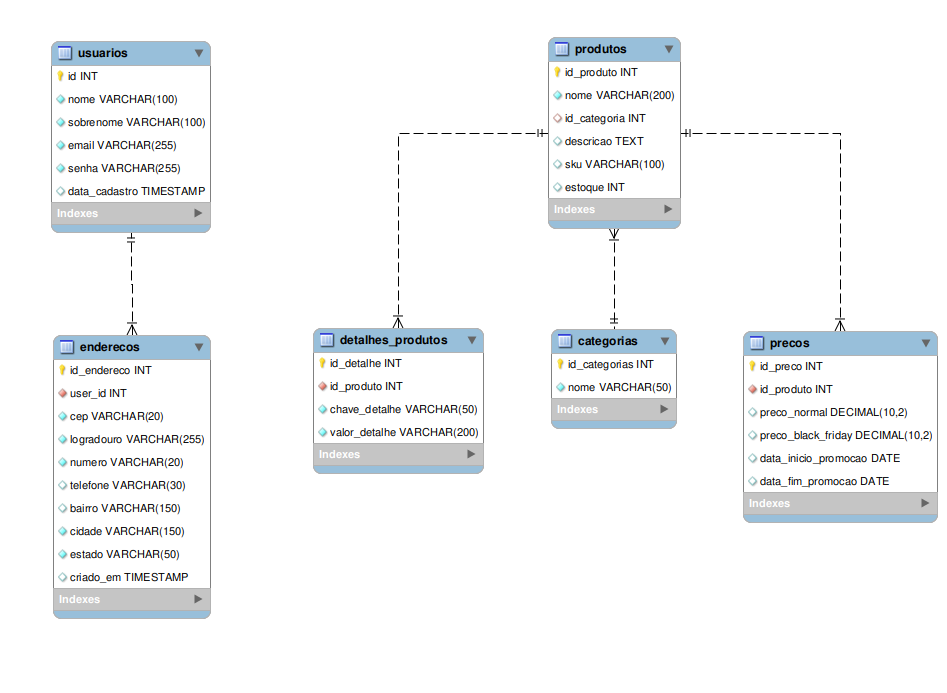

# 🛍️ ByteShop — Site de E-commerce (Edição Black Friday)

Este projeto foi desenvolvido como parte da disciplina **Desenvolvimento Web**, com o objetivo de aplicar e integrar os principais conceitos estudados ao longo do curso, criando uma aplicação web completa de e-commerce.

---

## 🎯 Objetivo

O propósito do projeto é consolidar o conhecimento adquirido em **HTML**, **CSS**, **JavaScript**, **PHP** e **MySQL**, promovendo a integração entre:

- Front-end
- Back-end
- Banco de dados
- Camada de análise de dados

Além disso, o projeto inclui:

- Integração com o **Google Looker Studio** para criação de dashboards analíticos;
- Consumo de **duas APIs externas** para enriquecer a aplicação com dados dinâmicos.

---

## 🖥️ Sobre o Site

O site, denominado **ByteShop**, é uma loja virtual especializada em produtos de tecnologia.  
As principais categorias de produtos são:

- 💻 **Computadores**
- 📱 **Celulares**
- 🎮 **Video Games**

Durante o período da **Black Friday**, o site apresenta promoções exclusivas, destacando produtos e ofertas na página inicial.

---

## 🗂️ Estrutura de Pastas do Projeto `projeto-web-uniruy`

```
projeto-web-uniruy/
│
├── assets/       # Arquivos estáticos
│   ├── css/      # Arquivos de estilo
│   ├── js/       # Scripts JavaScript
│   └── img/      # Imagens do site
│
└── docs/         # Documentação do projeto
|   ├── diagramas/         # Diagramas UML, fluxogramas
|   └── data/              # Base para criar o Banco de dados 
│
├── helpers/        # Cria Links absolutos para imagems, estilos 
│   └── url.php     # Define a variável BASE_URL com o endereço base do sistema
│
├── templates/        # templates para reuso do navbar e footer (evitando duplicação de código)
│   └── header.php    
│   └── footer.php
├── php/            # conexão com banco e processamento dos formularios
│   └── conexao.php   
│   └── router.php 
     
```

---

## ⚙️ Tecnologias Utilizadas

| Camada         | Tecnologias             |
| :------------- | :-------------------- |
| Front-end      | HTML5, CSS3, JavaScript |
| Back-end       | PHP                     |
| Banco de Dados | MySQL                   |
| Dashboard      | Google Looker Studio    |
| Integrações    | 2 APIs externas         |

---

## 📊 Diagrama de Casos de Uso

O diagrama abaixo representa as principais interações do sistema:


---
## 📊 Diagrama de Classes


---
## 📊 Diagrama de Entidade-Relacionamento (Banco de Dados)



---
## 🚀 Funcionalidades Principais

- Cadastro e login de usuários
- Navegação por categorias e produtos
- Carrinho de compras
- Processamento de pedidos
- Destaque de promoções da Black Friday
- Integração com dashboards analíticos
- Consumo de APIs externas para dados dinâmicos

---

## 📌 Observações

- Seguindo boas práticas de organização, toda a lógica de negócio está separada do front-end e do acesso ao banco de dados.  
- Os arquivos estáticos (CSS, JS, imagens) ficam na pasta `assets/`.  
- Os diagramas e documentação adicional estão na pasta `docs/`.
